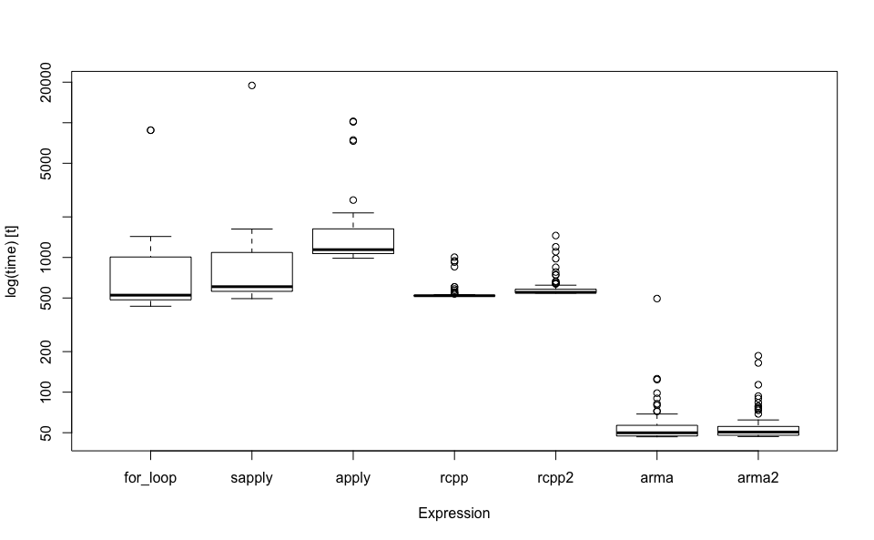
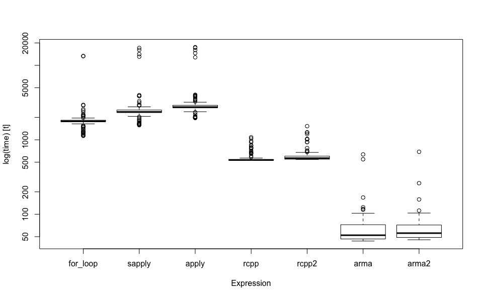

19 Jan 2019

<!-- README.md is generated from README.Rmd. Please edit that file -->

# colprods

The goal of colprods is to provide a simple example of how to
incorporate Rcpp and RcppArmadillo functions into a package. It does
this using various implementations of a function to calculate the column
products of a numeric matrix.

## Installation

You can install the released version of colprods from
[Github](https://www.github.com/dkidney/colprods) with:

``` r
devtools::install_github("dkidney/colprods")
```

## Simple example

``` r
x = matrix(1:9, 3)
x
#>      [,1] [,2] [,3]
#> [1,]    1    4    7
#> [2,]    2    5    8
#> [3,]    3    6    9
```

``` r
library(colprods)
#> colprods version 0.0.0.9000. For help, type: ?colprods
```

``` r
colprods_for_loop(x)
colprods_sapply(x)
colprods_apply(x)
colprods_rcpp(x)
colprods_rcpp_rowwise(x)
colprods_arma(x)
as.numeric(colprods_arma(x))
#> [1]   6 120 504
#> [1]   6 120 504
#> [1]   6 120 504
#> [1]   6 120 504
#> [1]   6 120 504
#>      [,1] [,2] [,3]
#> [1,]    6  120  504
#> [1]   6 120 504
```

Notice that `colprods_arma` returns a matrix - this is because I haven’t
worked out how to coerce a single-row matrix into a vector within the
RcppArmadillo code.

## Benchmarking

``` r
library(dplyr)
library(microbenchmark)
bench = function(x){
    microbenchmark(
        "for_loop" = colprods_for_loop(x),
        "sapply"   = colprods_sapply(x),
        "apply"    = colprods_apply(x),
        "rcpp"     = colprods_rcpp(x),
        "rcpp2"    = colprods_rcpp_rowwise(x),
        "arma"     = colprods_arma(x),
        "arma2"    = as.numeric(colprods_arma(x))
    )
}
print_bench = function(x){
    x %>% 
        summary %>% 
        mutate(mean_rel = mean / min(mean)) %>% 
        mutate(median_rel = median / min(median)) %>% 
        select(expr, mean, median, mean_rel, median_rel, neval) %>% 
        mutate_at(vars(mean, median), round) %>% 
        mutate_at(vars(ends_with("_rel")), funs(round(., 1))) %>% 
        print.data.frame(row.names = FALSE)
}
```

### Tall matrix

``` r
nr = 1000
nc = 100
x = matrix(rnorm(nr * nc), nr, nc)
bench_tall = x %>% bench
bench_tall %>% print_bench
#>      expr mean median mean_rel median_rel neval
#>  for_loop  981    515     18.5       10.6   100
#>    sapply 1034    600     19.5       12.4   100
#>     apply 1430   1126     27.0       23.3   100
#>      rcpp  538    519     10.1       10.7   100
#>     rcpp2  585    550     11.0       11.4   100
#>      arma   53     48      1.0        1.0   100
#>     arma2   61     50      1.2        1.0   100
bench_tall %>% boxplot(log = TRUE)
```



### Wide matrix

``` r
nr = 100
nc = 1000
x = matrix(rnorm(nr * nc), nr, nc)
bench_wide = x %>% bench
bench_wide %>% print_bench
#>      expr mean median mean_rel median_rel neval
#>  for_loop 2412   1790     36.1       34.1   100
#>    sapply 2711   2423     40.6       46.1   100
#>     apply 3390   2763     50.7       52.6   100
#>      rcpp  553    533      8.3       10.1   100
#>     rcpp2  631    562      9.4       10.7   100
#>      arma   75     53      1.1        1.0   100
#>     arma2   67     53      1.0        1.0   100
bench_wide %>% boxplot(log = TRUE)
```


